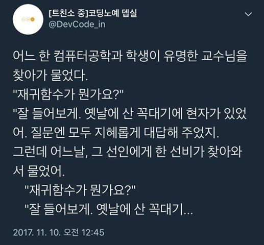

# 자전거

## 재귀함수란



재귀함수는 말그래로 `재귀(본디의 곳으로 다시 돌아오는 것)` 하는 함수를 의미합니다.

그럼 어디로 돌아온다는 걸까요?

바로 자기 자신에게 돌아온다는 의미입니다. 뭔가 말이 이상하죠? 코드로 한번 봐보겠습니다.

```python
def f(n):
  print(n)
  f(n-1)
```

위 파이썬 코드는 f 라는 함수를 선언하고 있습니다. 어? 근데, f라는 함수에서 `f(n-1)` 을 호출하고 있는 모습이 보입니다.

처음에는 뭔가 이해가 안가는 구조일 수 있지만 f라는 함수에서 다른 함수도 아닌 자기 자신 f를 호출하고 있는데, 이걸 바로 재귀함수라고 합니다.

```python
만약 f(5) 를 호출했다고 해볼까요?

f(5)는 print(5)로 5를 출력하고, f(4)를 호출할 겁니다.

그럼 또, f(4)는 print(4)로 4를 출력하고, f(3)를 호출할 겁니다.

그럼 또, f(3)는 print(3)로 3을 출력하고, f(2)를 호출할 겁니다.

...

그럼 또, f(-1000000)는 print(-1000000)로 -1000000을 출력하고, f(-1000001)를 호출할 겁니다.

...

```

이렇게 계속 무한히 함수를 호출할 거고, 이는 무한 루프에 빠지게 됩니다.

그럼 어떻게해야 이 재귀 함수를 무한히 호출하지 않을까요?

바로 제한 조건을 추가해야합니다.

어떤식으로 하면 될까요? 예시를 한번 보겠습니다.

```python
def f(n):
  if n <= 0:
    return 0

  print(n)
  f(n-1)
```

위 파이썬 코드는 이전 예시와 비슷한 구조를 가지고 있습니다. 하지만, if문(조건문)이 추가된 모습을 볼 수 있습니다.
왜일까요? 이번에는 한번 f(3)을 호출한 상황을 살펴보겠습니다.

```python

f(3)는 print(3)로 3을 출력하고, f(2)를 호출할 겁니다.

그럼 또, f(2)는 print(2)로 2를 출력하고, f(1)를 호출할 겁니다.

그럼 또, f(1)는 print(1)로 1를 출력하고, f(0)를 호출할 겁니다.

여기서 잠깐!!!!!

f(0)이 호출되었을 때, 당연하게도 0이 출력될거라고 생각하셨나요?
0은 출력되지 않습니다. 왜냐? if(n<=0) 조건문에 걸려서 함수가 return(종료)되었기 때문입니다.

```

이해되셨나요?

이해가 되지 않으셨다면 위 코드를 한번 직접 작성해보고 실행해보시면 될 것 같아요 :D

(그래도 이해가 되지 않는다면 질문해주세요! 꼬오옥!)

> 이제 아래 문제들을 풀면서 재귀함수를 더 자세히 익혀봅시다!

## 재귀함수를 이용한 문제를 풀어볼까요?
- [[기초-재귀함수] 재귀로 * n개 한 줄로 출력하기](https://codeup.kr/problem.php?id=1851)
- [[기초-재귀함수] 재귀로 1부터 n까지 한 줄로 출력하기](https://codeup.kr/problem.php?id=1852)
- [[기초-재귀함수] 재귀로 1부터 n까지 합 리턴하기](https://codeup.kr/problem.php?id=1853)
- [[기초-재귀함수] 재귀로 각 자리 수의 합 리턴하기](https://codeup.kr/problem.php?id=1854)
- [[기초-재귀함수] 재귀로 n번째 피보나치 수 리턴하기](https://codeup.kr/problem.php?id=1855)
- [[기초-재귀함수] 계단 뛰어 오르기](https://codeup.kr/problem.php?id=1856)
- [[기초-재귀함수] 서로 다른 n개 중에서 r개 순서없이 고르기](https://codeup.kr/problem.php?id=1857)
- [[기초-재귀함수] 파스칼의 삼각형 출력하기 1](https://codeup.kr/problem.php?id=1858)
- [[기초-재귀함수] 별 삼각형 출력하기](https://codeup.kr/problem.php?id=1859)
- [[기초-재귀함수] 수 삼각형 출력하기](https://codeup.kr/problem.php?id=1860)
- [[기초-재귀함수] 파스칼의 삼각형 출력하기 2](https://codeup.kr/problem.php?id=1861)
- [[기초-재귀함수] 재귀로 n번째 피보나치 수 출력하기](https://codeup.kr/problem.php?id=1862)
- [(재귀 함수) 1부터 n까지 출력하기](https://codeup.kr/problem.php?id=1901)
- [(재귀 함수) 1부터 n까지 역순으로 출력하기](https://codeup.kr/problem.php?id=1902)
- [(재귀함수) 두 수 사이의 홀수 출력하기](https://codeup.kr/problem.php?id=1904)
- [(재귀함수) 1부터 n까지 합 구하기](https://codeup.kr/problem.php?id=1905)
- [(재귀함수) 팩토리얼 계산](https://codeup.kr/problem.php?id=1912)
- [(재귀함수) 피보나치 수열](https://codeup.kr/problem.php?id=1915)
- [(재귀함수) 2진수 변환](https://codeup.kr/problem.php?id=1920)
- [[재귀함수] 진법 변환](https://codeup.kr/problem.php?id=1921)
- [[재귀함수] 3n+1](https://codeup.kr/problem.php?id=1922)
- [(재귀함수) nCr (Small)](https://codeup.kr/problem.php?id=1925)
- [(재귀함수) 우박수 (3n+1) (basic)](https://codeup.kr/problem.php?id=1928)
- [(재귀함수) 삼각형 출력하기 1](https://codeup.kr/problem.php?id=1953)
- [(재귀함수)삼각형 출력하기 2](https://codeup.kr/problem.php?id=1954)
- [이진수 변환](https://www.acmicpc.net/problem/10829)
- [재귀함수가 뭔가요?](https://www.acmicpc.net/problem/17478)
- [별 찍기 - 10](https://www.acmicpc.net/problem/2447)
- [별 찍기 - 11](https://www.acmicpc.net/problem/2448)


## 진법 기억하시나요?

여러분, 진법 기억하시나요?

우리 일상생활에서의 진법은 10진법이죠.

컴퓨터에서는 2진법을 사용하고, 컴퓨터 과학에서는 2진법을 쉽게 보기 위해, 8진법, 16진법도 사용한답니다.

근데, 이 진법의 원리를 조금 파볼까요? (아마...초등학교 때 배우셨을거고, 쉬운 이야기이니 넘기셔도 됩니다 ㅎㅎ)

우리가 143이라는 10진법 숫자를 분해한다면 아래와 같이 분해할 수 있을거에요.

`143 = 1 x 10^2 + 4 x 10^1 + 3 x 10^0`

각 자리에 있는 수마다 10의 자릿수 제곱만큼을 곱한 형태로 말이죠!

근데, 2진법이라고 해서 다를게 없어요.

10011(2)이라는 숫자를 볼까요?

이 숫자는 10진법으로 19를 의미하는데,

10011(2) = 1 x 2^4 + 0 x 2^3 + 0 x 2^2 + 1 x 2^1 + 1 x 2^0 = 16 + 2 + 1 이기 때문입니다.

어? 위의 수식과 비교해보니 보니까 각 자릿수들(숫자가 다르니까!)과 제곱되는 숫자들이 10이 2로만 바뀐 것 같죠? ㅎㅎ

이렇게 2진법은 특이한게 아니고, 단지 숫자를 어떻게 나타내느냐의 차이일뿐입니다. 어려워하지말아요 🥰

## 진법과 관련된 문제를 풀어볼까요?
- [9진수](https://www.acmicpc.net/problem/14491)
- [3진법 뒤집기](https://programmers.co.kr/learn/courses/30/lessons/68935)
- [이건 무슨 진법이지?](https://www.acmicpc.net/problem/13877)

## 스택은 뭘까요?

스택은 생각보다 이해하기 쉬운 자료구조입니다.

FILO(First In, Last Out) 라는 규칙을 가지고 있는데요.

말그대로 스택은 처음으로(먼저) 들어간것이 맨 마지막(나중에) 나오는 규칙을 가진 자료구조라는 것입니다.

한번 아래 그림을 볼까요?


[image 출처](https://medium.com/@songjaeyoung92/%EC%9E%90%EB%A3%8C%EA%B5%AC%EC%A1%B0-javascript-stack-%EC%9D%B4%EB%9E%80-31f9bbb84897)

```
스택은 마치 막혀있는 골목, 혹은 위 링크의 글과 같이 프링글스에 비유하고 합니다.

먼저 비어있는 스택에 1을 넣었습니다(push).

그리고 스택에 2를 넣습니다(push). 

스택에는 총 2개(size)의 데이터가 들어가있겠죠?

그리고, 스택에 있는 데이터(top)를 확인하려고 하면

1은 바로 확인할 수 없고, 먼저 2를 빼고(pop)나서야 top에 1이 있는 것을 확인할 수 있습니다.
```

굉장히 심플한 자료구조입니다. 🐶

근데, 이걸 문제 풀이에 어떻게 써먹는데! 라는 생각이 들 수 있습니다.

그래서 스택을 이용한 문제 풀이 예시를 들어보겠습니다. 

스택은 아이디어가 중요하기 때문에, 아래 문제들을 예시를 들어보면서 설명을 하려합니다.

- [막대기](https://www.acmicpc.net/problem/17608)
- [괄호](https://www.acmicpc.net/problem/9012)

### 막대기 문제 풀이

> 문제 내용은 꼭 링크에 들어가서 먼저 확인해주세요.

이제 우리가 뭘 생각해봐야 할까요? 먼저 오른쪽에서 봤을 때 어떻게 보일까요?

오른쪽에서 보는 걸 기준으로 점점 크기가 작아지는 막대기를 볼 수 있습니다.

왜? 오른쪽에 있는 막대가 왼쪽에 있는 막대보다 크다면, 왼쪽에 있는 막대가 안보이니까요.

그럼 아래 코드와 같이 스택의 아이디어를 이용해 풀어봅시다.

먼저 이 문제는 python으로 구현해볼게요.

```python
# import sys
# n = int(sys.stdin.readline())
# L = [int(sys.stdin.readline()) for i in range(n)]
"""
python으로 이 문제를 풀려면, 위 입력 방식을 사용해야 합니다.
python의 기본 입출력이 너무 느리기에... 이 문제에서는 어쩔 수 없이 이 방식을 사용해야 하고,
일단 아래 코드와 같다고 생각해주시면 됩니다.
"""

n = int(input())
L = [int(input()) for i in range(n)]

stk = []

"""
놀랍게도, python에서는 리스트를 이용해서
간단하게 stack을 사용할 수 있습니다.

push의 개념은 append()로
top의 개념은 stk[-1]로
pop의 개념은 pop()으로
size의 개념은 len(stk)로 말이죠.
"""

for i in range(0, n):
  crt = L[i]
  if len(stk) == 0: # stack이 비어있다면,
    stk.append(L[i]) # stack에 그래도 값을 push한다.
  else: # stack에 값이 들어가 있다면,
    while len(stk) > 0 and stk[-1] < crt: # stack에 값이 있고, stack의 top이 현재값과 같거나 작으면, 계속해서
      stk.pop() # pop한다.
    stk.append(crt) # 이제 왼쪽에 현재값보다 작은 값이 없기 때문에 push한다.
print(len(stk))
  

# 물론 이 문제는 다른 아이디어로도 풀 수 있고, 심지어 더 간단하게 풀 수 있습니다. 어떻게 하면 될까요? ㅎㅎ
```


### 괄호 문제 풀이

> 문제 내용은 꼭 링크에 들어가서 먼저 확인해주세요.

굉장히 실생활에서 익숙한 문제죠?

바로 코드로 들어가서 보겠습니다.

이번에는 C++ 코드로 볼게요.

```cpp
#include <iostream>
#include <stack>
using namespace std;
// 직접 stack을 구현해서 써도 되지만, STL의 stack을 써서 더 편하게 문제 풀이를 해볼게요. 

// 과연 아래 풀이가 정말 최적일까요? 더 간단하게 풀 수 있는 방법은 없을까요? 한번 생각해보시면 좋을 것 같아요.

bool isVPS(string s) {
  stack<char> stk; // 스택 선언

  for(int i = 0; i < s.length(); i++) { // 문자열을 앞에서부터 쭉 탐색합니다.
    if(s[i] == '(') { // 만약 현재 문자가 ( 여는 괄호 문자라면,
      stk.push(s[i]); // 바로 스택에 넣어줍니다.
    } else if(s[i] == ')') { // 만약 현재 문자가 ) 닫는 괄호 문자라면,
      if(stk.size() == 0) return false; // 현재 스택에 쌓여있는 ( 여는 문자가 없다면, 이는 VPS가 아닙니다.
      stk.pop(); // 현재 스택에 쌓여있는 ( 여는 문자가 있다면, 짝이 맞는 괄호가 있다는 의미이므로 stack에서 ( 를 하나 제거합니다.
    }
  }
  if(stk.size() > 0) return false; // 모든 문자열을 훑었는데도, ( 여는 문자가 남아있다면 이는 VPS가 아닙니다.
  return true; // 모든 제한 조건을 통과하였으니, 이는 VPS입니다. 
}

int main() {
  int N;
  string s;
  cin >> N;
  for(int i = 0; i < N; i++) {
    cin >> s;
    cout << (isVPS(s) ? "YES" : "NO") << "\n";
  }

  return 0;
}
```

## 스택을 활용한 문제를 풀어볼까요?
- [스택](https://www.acmicpc.net/problem/10828)
- [거꾸로 출력하기 3](https://codeup.kr/problem.php?id=1402) : 스택을 이용하지 않아도 되지만, 스택의 아이디어를 활용해봅시다. 
- [단어순서 뒤집기](https://www.acmicpc.net/problem/12605) : 스택을 이용하지 않아도 되지만, 스택의 아이디어를 활용해봅시다.
- [숫자 거꾸로 출력하기](https://codeup.kr/problem.php?id=1714)
- [천단위 구분기호](https://codeup.kr/problem.php?id=2016) : 정규 표현식이라는걸 찾아보시고 사용해보셔도 됩니다. :D
- [큰 수 덧셈](https://codeup.kr/problem.php?id=3021)
- [0은 빼!](https://codeup.kr/problem.php?id=3117)
- [수식 계산1](https://codeup.kr/problem.php?id=3127) : 먼저, 전위, 중위, 후위 표기법에 대해서 먼저 알아보셔도 좋습니다.
- [좋은 단어](https://www.acmicpc.net/problem/3986)
- [균형잡힌 세상](https://www.acmicpc.net/problem/4949)
- [제로](https://www.acmicpc.net/problem/10773)
- [괄호 끼워넣기](https://www.acmicpc.net/problem/11899)
- [도키도키 간식드리미](https://www.acmicpc.net/problem/12789)
- [스택 수열](https://www.acmicpc.net/problem/1874)
- [쇠막대기](https://www.acmicpc.net/problem/10799) : 조금 어려울 수 있어요. 스킵하셔도 됩니다.
- [괄호의 값](https://www.acmicpc.net/problem/2504)
- [안정적인 문자열](https://www.acmicpc.net/problem/4889)

## 큐는 뭘까요?

위 스택을 이해하셨나요? 그렇다면 큐는 굉장히 이해하기 편하실거에요.

큐는 스택과 반대로, FIFO(First In, First Out) 의 규칙을 가지고 있습니다.

말그대로 큐는 먼저 들어간 것이 먼저 나오는 규칙을 가진 자료구조입니다.

스택은 우리 일상생활에서 익숙합니다.

예를 들면, 선착순으로 줄을 서는 상황이 있죠.

한번 놀이공원에서 놀이기구를 타기위해 기다리고 있는 상황을 떠올려볼까요.

```
앞에 현재 3팀(size)이 기다리고 있습니다.

그리고 제가 줄을 섭니다.(push)

이때 기다리고 있는 팀은 4팀이 됩니다.

그리고, 맨 앞에 있는 팀(front)이 놀이기구에 입장을 합니다.(pop)

...

그렇게 모든 입장객이 놀이기구를 타고, 기다리고 있는 사람이 없어집니다.(empty)
```

스택과 차이점을 아시겠나요?

큐는 문제 풀이 예시를 들지 않겠습니다.

C++에서는 `#include <queue>` 를 사용할 수 있으며,

python에서는 또.. 리스트로 구현할 수 있습니다.ㅎㅎ 

## 큐를 활용한 문제를 풀어볼까요?
- [큐](https://www.acmicpc.net/problem/10845) : 여기서 나오는 큐는 back을 구해야 합니다. C++ STL Queue로 back을 알아낼 수 있을까요? 어떤 게 필요할까요?
- [큐 2](https://www.acmicpc.net/problem/18258)
- [요세푸스 문제 0](https://www.acmicpc.net/problem/11866)
- [요세푸스 문제](https://www.acmicpc.net/problem/1158)
- [카드 2](https://www.acmicpc.net/problem/2164)
- [프린터 큐](https://www.acmicpc.net/problem/1966)


## 해쉬는 뭘까요?

python에서는 해쉬를 굉장히 손쉽게 써오고 있었습니다.

바로 dictionary릃 이용해서 말이죠.

해쉬는 복잡한 이론까지 가면 굉장히 복잡할 수 있는 자료구조이지만... 우리는 이것만 기억합시다.

> "Key와 Value가 있는 자료구조"

> Key를 통해 Value를 조회하는 로직으로, 문제 풀이방식을 바꿀 수 있다.!

python에서는 쉽게 쓸 수 있다고 했으니, C++ 에서는 어떻게 해야 할까요?

물론, 직접 구현해서 써도 됩니다. 해쉬 자체를 공부하기 위해서라면 좋지만..

우리는 해쉬를 써서 알고리즘 문제 풀이를 하는 것이니 조금 더 쉽게, STL의 map을 써보겠습니다.

map 문법을 모두 다루기엔... 이미 작성된 것이 많으니 아래 링크를 남기겠습니다 ㅎㅎ

[map 설명 1](https://blockdmask.tistory.com/87)

[map 설명 2](https://life-with-coding.tistory.com/305)

## 해쉬를 이용한 문제를 풀어볼까요?
- [No Duplicates](https://www.acmicpc.net/problem/15098)
- [회사에 있는 사람](https://www.acmicpc.net/problem/7785)
- [베스트셀러](https://www.acmicpc.net/problem/1302)
- [나는야 포켓몬 마스터 이다솜](https://www.acmicpc.net/problem/1620)
- [CD](https://www.acmicpc.net/problem/4158)
- [배부른 마라토너](https://www.acmicpc.net/problem/10546)
- [동일한 단어 그룹화하기](https://www.acmicpc.net/problem/16499)

## 이제 자동차를 타러 가봅시다! 부릉부릉 🚘

## 번외 문제
- [8진수 2진수](https://www.acmicpc.net/problem/1212)
- [탑](https://www.acmicpc.net/problem/2493) : 이건 어려울 수 있어요.
- [크게 만들기](https://www.acmicpc.net/problem/2812)
- [문자열 폭발](https://www.acmicpc.net/problem/9935)
- [PPAP](https://www.acmicpc.net/problem/16120)
