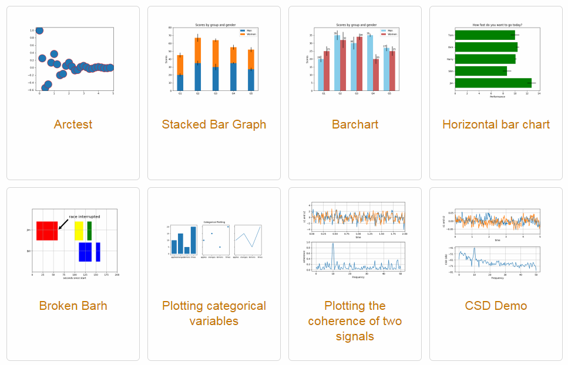
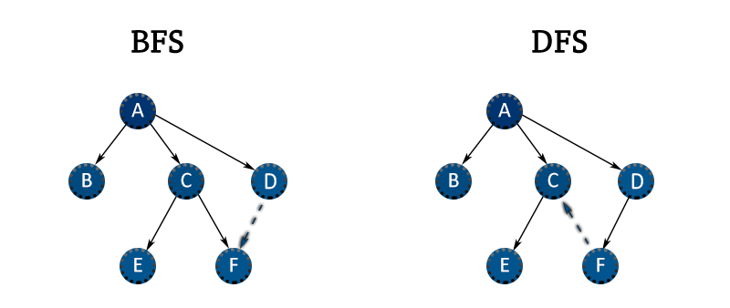

# 자동차

## 그래프에 대해서 알아볼까요?

그래프는 여러 문제를 해결할 때, 굉장히 유용한 자료구조 중 하나입니다.

일단 "그래프"라고 하면 여러분은 아래의 그래프들을 떠올리셨을 겁니다.



하지만 지금 여기서 말하는 그래프는 다른 느낌의 그래프를 말합니다.


그래프 자료구조는 먼저 정점과 간선이라는 걸 가지고 있습니다.

위 그림에서 보면 1, 2, 3, 4, 5, 6이라고 적힌 정점이 있고,

1과 2가 연결된 간선, 2와 3이 연결된 간선 ... 이 있습니다.

예를 들어보면, 지하철 노선도도 하나의 그래프입니다.

각 역이 정점이고, 역마다 연결되어 있는 노선(철도)이 간선인 것이지요.


그래프.. 이해가 되시나요?

물론 그래프의 종류는 이것밖에 없지 않습니다.

더욱 자세한 내용은 직접 하나하나 찾아보면서 습득해보시길 바랍니다!

## DFS/BFS란?

DFS/BFS는 그래프 이론을 활용하는 알고리즘 중 대표적인 문제 중 하나입니다.

DFS/BFS는 그래프를 어떻게 탐색하는지에 대한 방법이라고 할 수 있습니다.

```
DFS: Depth First Search / 깊이 우선 탐색
BFS: Breath First Search / 너비 우선 탐색
```

아래 그래프 그림에서 두가지 탐색 방법의 예시를 들어볼게요.

(아래 그래프는 방향 그래프입니다. 방향 그래프가 뭔지 모르겠다구요? 괜찮아요. 그냥 간선에 방향이 정해져있다고만 생각하고 일단 넘어가도 됩니다)

(그림은 알파벳 순으로 탐색을 하고 있지 않아서 아래 글과 일부 달라보일 수 있습니다. ㅎㅎ 방향만 확인해주세요.)



### DFS

DFS는 최대한 깊게 깊게 끝까지 탐색한다고 생각하면 됩니다.

최대한 깊고, 알파벳 순서대로 노드들을 탐색을 한다고 가정을 하고, 먼저 A에서 출발을 할게요.

```
1. A 다음은 B, C, D 중 어디일까요? 알파벳 순이기 때문에 B입니다.

2. B 다음은 어디일까요? B에서 더이상 갈 곳이 없기 때문에 A에서의 다음 정점을 찾게 됩니다.

3. 이번엔 어디로 가야할까요? B는 이미 방문했기 때문에 C로 가게 됩니다.

4. C 다음은 D일까요? 아니요! 최대한 깊게 내려가기 때문에 먼저 E를 방문하게 됩니다.

5. 그다음부터는 F, D를 탐색하고 DFS 탐색을 끝나게 됩니다.
```

근데, 이 탐색은 어떻게 구현할까요?

바로 재귀함수와 스택을 이용합니다!

여기까지만 설명을 드릴게요. 한번 직접 구현해보시면서 DFS를 공부해보시길 추천드립니다.

너무 어렵다면, 예제코드를 달라고 요청해주세요! :D

### BFS

BFS는 DFS와 달리 최대한 넓게 탐색한다고 생각하면 됩니다.

BFS도 마찬가지로 최대한 넓게 탐색하면서 알파벳 순서대로 탐색을 한다고 가정을 하고, 먼저 A에서 출발을 할게요.

```
1. A 다음은 B, C, D 중 어디일까요? 마찬가지로 알파벳 순이기때문에 B입니다.

2. B 다음은 어디일까요? 또, B에서 더이상 갈 곳이 없기 때문에 A에서의 다음 정점을 찾게 됩니다.

3. 이번엔 어디로 가야할까요? B는 이미 방문했기 때문에 C로 가게 됩니다.

4. C 다음에 DFS와 같이 또 아래 E로 내려갈까요? 아니요 BFS는 최대한 넓게 방문한다고 했기 때문에 먼저 D를 갑니다.

5. 그리고 나서, C 아래로 내려가 E를 방문하고 그 다음으로 F를 방문하고 BFS 탐색이 끝나게 됩니다.
```

DFS는 BFS와 갈라서 헷갈리시나요? 

BFS는 한 층을 쭉 돌고, 아래 층으로 내려간다! 라고 생각하시면 조금 이해가 편할 것 같아요.

그럼 이 BFS는 어떻게 구현할까요?

바로 큐를 이용합니다!

BFS도 마찬가지로 여기까지만 알려드리고, 직접 한번 찾아보시면서 공부해보시길 추천드립니다.

너무 어렵다면, 예제코드를 달라고 요청해주세요! :)

## DFS/BFS를 활용한 문제를 풀어볼까요?
- [바이러스](https://www.acmicpc.net/problem/2606)
- [토마토](https://www.acmicpc.net/problem/7576)
- [토마토](https://www.acmicpc.net/problem/7569)
- [유기농 배추](https://www.acmicpc.net/problem/1012)
- [치즈](https://www.acmicpc.net/problem/2636)
- [적록색약](https://www.acmicpc.net/problem/10026)
- [ABCDE](https://www.acmicpc.net/problem/13023)
- [숨바꼭질](https://www.acmicpc.net/problem/1697)
- [숨바꼭질 3](https://www.acmicpc.net/problem/13549)
- [DFS와 BFS](https://www.acmicpc.net/problem/1260)
- [촌수계산](https://www.acmicpc.net/problem/2644)
- [양](https://www.acmicpc.net/problem/3184)
- [양치기 꿍](https://www.acmicpc.net/problem/3187)
- [섬의 개수](https://www.acmicpc.net/problem/4963)
- [침투](https://www.acmicpc.net/problem/13565)
- [전쟁 - 전투](https://www.acmicpc.net/problem/1303)
- [그림](https://www.acmicpc.net/problem/1926)
- [물통](https://www.acmicpc.net/problem/2251)
- [단지번호붙이기](https://www.acmicpc.net/problem/2667)
- [양 한마리... 양 두마리...](https://www.acmicpc.net/problem/11123)
- [현수막](https://www.acmicpc.net/problem/14716)
- [빙산](https://www.acmicpc.net/problem/2573)
- [팀배분](https://www.acmicpc.net/problem/1953)

## 다이나믹 프로그래밍에 대해서 알아볼까요?

TODO: DP 설명

## 다이나믹 프로그래밍 문제를 풀어볼까요?

(개인적인 생각입니다.) 다이나믹 프로그래밍은 가끔은 직관에 맞겨야 하기도 합니다.
그렇기 때문에 최대한 많은 문제로 경험을 쌓으면 잘 하게 되는 분야라고 생각합니다 ^.^

### 피보나치 수열 시리즈
- [피보나치 수열](https://codeup.kr/problem.php?id=2601)
- [피보나치 수 5](https://www.acmicpc.net/problem/10870)
- [피보나치 수 2](https://www.acmicpc.net/problem/2748)
- [피보나치 비스무리한 수열](https://www.acmicpc.net/problem/14495)
- [피보나치 수 7](https://www.acmicpc.net/problem/15624)

### 타일 채우기 시리즈
- [타일 채우기](https://www.acmicpc.net/problem/2133)
- [타일 채우기 2](https://www.acmicpc.net/problem/13976)
- [타일 채우기 3](https://www.acmicpc.net/problem/14852)
- [타일 채우기 4](https://www.acmicpc.net/problem/15700)
- [2×n 타일링](https://www.acmicpc.net/problem/11726)
- [2×n 타일링 2](https://www.acmicpc.net/problem/11727)
- [타일링](https://www.acmicpc.net/problem/1793)
- [타일 채우기](https://www.acmicpc.net/problem/2133)


### 1, 2, 3 더하기 시리즈
- [1, 2, 3 더하기](https://www.acmicpc.net/problem/9095)
- [1, 2, 3 더하기 2](https://www.acmicpc.net/problem/12101)
- [1, 2, 3 더하기 3](https://www.acmicpc.net/problem/15988)
- [1, 2, 3 더하기 4](https://www.acmicpc.net/problem/15989)
- [1, 2, 3 더하기 5](https://www.acmicpc.net/problem/15990)
- [1, 2, 3 더하기 6](https://www.acmicpc.net/problem/15991)
- [1, 2, 3 더하기 7](https://www.acmicpc.net/problem/15992)
- [1, 2, 3 더하기 8](https://www.acmicpc.net/problem/15993)
- [1, 2, 3 더하기 9](https://www.acmicpc.net/problem/16195)

### 돌게임 시리즈
- [돌 게임](https://www.acmicpc.net/problem/9655)
- [돌 게임 2](https://www.acmicpc.net/problem/9656)
- [돌 게임 5](https://www.acmicpc.net/problem/9659)
- [돌 게임 6](https://www.acmicpc.net/problem/9660)

### 기타
- [기억력 테스트 7](https://codeup.kr/problem.php?id=3007)
- [파스칼 삼각형](https://codeup.kr/problem.php?id=3701)
- [사탕 줍기 1](https://codeup.kr/problem.php?id=3703)
- [계단 오르기 1](https://codeup.kr/problem.php?id=2632)
- [계단 오르기 2](https://codeup.kr/problem.php?id=3704)
- [연속된 구간의 최대합](https://codeup.kr/problem.php?id=3705) 
- [합의 개수](https://codeup.kr/problem.php?id=3707)
- [올바른 괄호 3](https://codeup.kr/problem.php?id=3715)
- [nCr (Hell)](https://codeup.kr/problem.php?id=3720)
- [LIS (Small)](https://codeup.kr/problem.php?id=3735) : LIS를 DP로 맛봅시다!
- [0/1 배낭 문제(Knapsack Problem)](https://codeup.kr/problem.php?id=3740) : 냅색 문제를 들어보셨나요? 모르신다면, 일단 넘어가도 좋습니다...
- [RGB 거리](https://codeup.kr/problem.php?id=3803)
- [RGB 거리](https://www.acmicpc.net/problem/1149)
- [스티커](https://codeup.kr/problem.php?id=3804)
- [스티커](https://www.acmicpc.net/problem/9465)
- [동물원](https://codeup.kr/problem.php?id=3806)
- [동물원](https://www.acmicpc.net/problem/1309)
- [동전 줍기](https://codeup.kr/problem.php?id=4019)
- [극장 좌석](https://codeup.kr/problem.php?id=4548)
- [계단 오르기](https://codeup.kr/problem.php?id=4564)
- [색 상환](https://codeup.kr/problem.php?id=4689) : 이건 진짜 생각해내기 어려울 수 있어요. (코테용 문제는 아닙니다.)
- [BABBA](https://www.acmicpc.net/problem/9625)
- [설탕 배달](https://www.acmicpc.net/problem/2839)
- [파스칼의 삼각형](https://www.acmicpc.net/problem/16395)
- [안녕](https://www.acmicpc.net/problem/1535)
- [연속합](https://www.acmicpc.net/problem/1912)
- [정수 삼각형](https://www.acmicpc.net/problem/1932)
- [동전 1](https://www.acmicpc.net/problem/2293)
- [동전 2](https://www.acmicpc.net/problem/2294)
- [서로 다른 자연수의 합](https://www.acmicpc.net/problem/9764)
- [쉬운 계단 수](https://www.acmicpc.net/problem/10844)
- [오르막 수](https://www.acmicpc.net/problem/11057)


## 브루트 포스의 기본 문제를 풀어볼까요?

쉽습니다 ㅎㅎ

모든 경우의 수를 탐색만 하면 됩니다! 그게 바로 브루트 포스니까!

- []()
- []()
- []()
- []()
- []()
- []()
- []()
- []()
- []()
- []()
- []()
- []()
- []()
- []()
- []()
- []()
- []()
- []()
- []()
- []()
- []()
- []()
- []()
- []()
- []()
- []()
- []()
- []()
- []()
- []()
- []()
- []()
- []()
- []()
- []()
- []()

## 브루트 포스와 DFS/BFS를 활용하는 문제를 풀어볼까요?
- [순열](https://www.acmicpc.net/problem/9742)
- [Z](https://www.acmicpc.net/problem/1074)
- []()
- []()
- []()
- []()
- []()
- []()
- []()
- []()
- []()
- []()
- []()
- []()
- []()

## 백트래킹에 대해서 알아볼까요?

- []()
- []()
- []()
- []()
- []()
- []()
- []()
- []()
- []()
- []()
- []()
- []()
- []()
- []()
- []()
- []()

## 분할 정복
- []()
- []()
- []()
- []()
- []()
- []()
- []()
- []()
- []()
- []()
- []()
- []()
- []()
- []()
- []()

## 우선순위 큐에 대해서 알아볼까요?
- []()
- []()
- []()
- []()
- []()
- []()
- []()
- []()
- []()
- []()


## 이제 비행기를 타러 가봅시다!

## 번외 문제
- [멀쩡한 사각형](https://programmers.co.kr/learn/courses/30/lessons/62048) (이 문제는 어려울 수 있어요. 생각이 나지 않는다면 넘겨도 됩니다.)
- [숨바꼭질 6](https://www.acmicpc.net/problem/17087)
